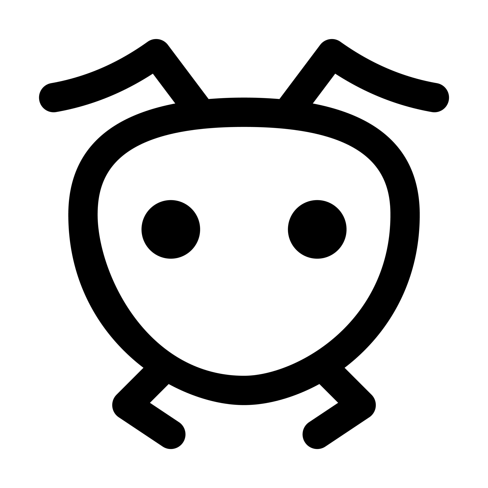

  
<h1 align="center"> Olá pegue o que você necessitar </h1></img>

  <a href="https://github.com/phikill">
    
  

<h1 align="left"> Sou novo em programação. </h1></img>

 
    
    
    
    
    
  
  
### 

 
      
  
  
 [//]: [] 
  
  
 
   

  
  
  

  

  
More info!  

   # Info.  
  *|  
  *|  
  *|  
  * 1. eu sou um iniciante 
   * 2. Eu não sei muito. 
     * Eu quero ser um programador de jogos  
     * Linguagens de programação nos estudos!...  
     - [x]  JAVA  
     - [x] DOS Language  
     - [ ] C#  
     - [ ] C/C++  
     - [ ] Intel Assembly  
   
    
     _______            _   _   __   _   _       _
                   
                                ██████╗  ██╗  ██╗ ██╗ ██╗  ██╗ ██╗ ██╗     ██╗                         
                                ██╔══██╗ ██║  ██║ ██║ ██║ ██╔╝ ██║ ██║     ██║                         
                                ██████╔╝ ███████║ ██║ █████╔╝  ██║ ██║     ██║                         
                                ██╔═══╝  ██╔══██║ ██║ ██╔═██╗  ██║ ██║     ██║                          
                                ██║      ██║  ██║ ██║ ██║  ██╗ ██║ ███████╗███████╗             
                                ╚═╝      ╚═╝  ╚═╝ ╚═╝ ╚═╝  ╚═╝ ╚═╝ ╚══════╝╚══════╝           
  
simple ASCII art
============   
    
    
  
  #### Future Projects.
  #  PARA POTATO PC'S
     * V PROJETOS V
     * | Build Inspencer Game Engine |
     * | Bloody Ants Z | 
     * | FB-I AM |
     * | Passnasty fantasy |
     * |  MAY JX   JAVA OS |
 ----
    
  [BUILD INSPENCER](https://github.com/NikuraCorp/build-inspencer-Engine)

  
   [//]:https://media1.giphy.com/media/OLHoXQgCVSWnfaVgXZ/giphy.gif?cid=790b7611ce304b6e091d2b9cbff0cbb2ce49419f81178279&rid=giphy.gif&ct=s
  
